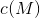
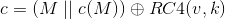
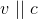
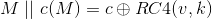

# Lecture 16 - June 25, 2018

## Crypto

### Symmetric key

Both alice and Bob share the same key
- Stream cipher: Generate a keystream
  - attacker can impact integrity, flipping a bit in the ciphertext flips that bit in the plaintext
- Block cipher: Divide the data into blocks of some fixed size (possibly pad), key length is block size

### Public Key
- Every party has a public and private key
- Typically require a much larger key size (1024+ bits)
- Use public key to perform a key exchange, switch to a symettric scheme for the session (ex. AES)

### Hash Functions

- Preimage resistance: Given h, can't find x such that `H(x) == h`
- Second Preimage resistance: Given (x, h), can't find a distinct x' such that `H(x') == H(x)` with `x' != x`
- Collision Resistance: Can't find distinct (x, x') such that `H(x) == H(x')`

### Message Authentiction Codes (MAC)
- Digital Signatures
- Sign: use you private key
- Verify: Use the public key

### Crypto Security Controls

Want to use cryptography to provide security control.
- **Issue**: Need to keep the key secret, how to provide access to legitimate users while keeping it hidden?
- If the key is on the machine, then it could potentially be captured by malware
- Web browser
  - a web browser could decrypt it's secrets on the fly, but if the browser can malware could also.
  - in practice: have a user master password that is used to decrypt the keystore
    - password managers (1password, lastpass)

#### Program and OS security
- public key is okay, allows for encryption and signature verification
- example: Apps are signed by the vendor before installation / upgrade.
  - clients can verify by obtaining a valid copy of the vendor's public key

#### Encrypted Code
- Research into processors that only execute encrypted code
- Processor decrypts instructions before execution
- Malware can only infect processes if it has the key
- Downsides:
  - slower, for each instruction, need to decrypt
  - upgrades, need to transmit keys

#### Encrypted Data
- Encrypt data on a device's storage, if an attacker obtains the device can't access the data with out the key
  - decryption key could be extracted from the devices memory
- doesn't protect against real users (who may install malware)
  - cold boot attacks
    - freeze the RAM (using liquid nitrogen)
    - Can remove it from the machine without loosing the data

#### OS Authentication
- Authentication mechanisms often involve crypto
  - salted hashes
- hardware tokens / TFA

#### Network security and privacy
- primary use of cryptography
- Entities you can only communicate with over a network are less trustworthy
  - can't tell if they are who they say they are
- Used at every layer of Network stack
  - link: WEP / WPA / WPA2
  - network: Vpn
  - transport: TLS/SSL
  - application: ssl

##### Link Layer Security controls
- protect the **local area network (LAN)**
- WEP had the following design goals:
  - **confidentiality**: prevent an adversary from learning about contents of wireless traffic
  - **access control**: prevent adversary from using your infrastructure
  - **data integrity**: Prevent an adversary from modifying packets
  - ...none of which held
  - **Spec**
    - sender and reciever share a secret key 
      -  is either 40 or 104 bits long
      - Because of US restrictions
    - Transmit a message M
      - Compute a checksum: 
      - Pick an IV v (24-bits), generate a keystream 
      - Compute 
      - Send 
        - note that v is sent as plaintext
    - Reciever gets 
      - Recompute 
      - 
      - Recompute the checksum for M, check that they match
  - Problems
    1. the IV is 24-bits long: You can just capture packets, eventually (about 5 hours) they will repeat. Once you see a packet with the same IV, you can decrypt the previously captured packets
    2. Checksum is CRC-32: not a good checksum for integrity guarantees
      - Linear Property: 
      - issue: If they have the checksums for each part seperately, they can compute a valid checksum
      - The attacker can modify the message by flipping bits (D), computing that checksum, computing . This is a valid packet due to the linear property of the checksum.

###### WEP Access Control

The adversary wants to inject some message F onto the protected network
- Given a single `(x, c)` pair
  - If the attacker can ping / send some traffic to the network (where the attacker knows the contents)
    - The attacker can capture the ciphertext from the network
  - This also gives the IV (recall, plaintext)
  - XOR the plaintext and ciphertext to get the keystream
  - use the keystream to encrypt their new message

The attacker can obtain this plaintext, ciphertext pair for free. As part of the authentication protocol
- The server sends the client some random number
- The client responds with the encryption of that number
  - Point is to prove that the client knows the secret key
- Allows an adversary to obtain the keystream for a new message of their choosing.

The initialization vector would initially start from 0 and count up

###### WEP Decryption attack
- the access point knows the secret key, the attacker can trick the access point into decrypting the packet
- the attacker snifs an encrypted packet off of the network
- Send the packet back to the access point, this causes the packet to be encrypted again
- But this leads to the packet being decrypted (assuming the same IV is used), recall that we're using RC4 (a stream cipher)
  - for example, you can time when that IV will be repeated, send the packet then

#### Replacement for WEP
- WPA: shortterm fixes
- WPA2: replace checksum CPC-32 with a real MAC scheme
  - 2004: AES-CCM mode
  - IV 48-bits
  - Keys are frequently changed
    - previously the key and IV would just be concatenated together, now they are mixed in some fashion
  - Could run on most WEP hardware
  - secure, except in PSK (pre-shared key mode)

### Network Layer Security
- Security on every link inside of a network is not enough, need **security across networks**
  - End-to-End is most ideal
- VPN
  - make 2+ distinct (i.e. physically isolated) networks appear to be the same
    - Or make a single remote host appear to be on the network (laptop -> network)
  - typical use case, corporations

**Goal**: An adversary sitting between the networks shouldn't be able to read (confidentiality) or modify (integrity) traffic flowing across the VPN
- note: still possible to analyze the encrypted traffic, DoS attacks still possible
- DOS: If you can take the link down, you impact availability
- traffic analysis: Observe patterns accross patterns

#### VPN setup
- each end needs a VPN gateway
  - firewall or DMZ
  - could be the laptop itself
  - the gateway facilitates encrypting the traffic (using cryptograhy), sending the traffic to the remote VPN gateway. By tunneling
- traffic that is intended for the other network is sent to the local VPN gateway

##### Tunneling
- Sending of messages in one protocol inside messages of another protocol as the payload, out of the usual protocol nesting sequence
  - TCP over IP is not tunneling, since this is the intended path (down the stack). This is encapsulation
  - IP over TCP is tunneling, going up the stack

