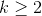
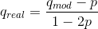

# Lecture 20 - July 16, 2018

## Design of secure databases

### Commutative Filters
- front end rewrites queries based on user's classification
  - Add a constraint which reflects the user's classification
  - remove attributes that the user isn't permitted to see

```sql
SELECT assignment
FROM Agents
WHERE Classification(user) AND sensitivity...
```

### Distributed Databases
- based on partitioning
  - different partitions may have different classifications
    - Top Secret, Secret, ...
  - based on Biba, Bell La-Padula
- Frontend forwards queries to the databases that the user can access
- scalability becomes an issue
  - lots of merging needs to be done
  - added complexity

### DBMS Views
- Logical database that represents a subset of some other database

```sql
CREATE VIEW foo AS SELECT * FROM BAR WHERE...
```

- query is transparent to the user, merged as needed
- The user gets only the elements that they are supposed to see
- Have a view which contains aggregate information

#### Truman vs. Non-Truman Semantics
- **Truman**: DBMS pretends that the user is allowed to see all data
  - all queries succeed, even if the results are incorrect
    - Average, where results are excluded are incorrect
  - Silently discard rows that the user is not permitted to access
- **Non-Truman**: DBMS can reject queries that asks for data the user is not allowed to access
  - queries that succeed are correct
  - some queries fail

## Data mining and Data Release
- try to automatically find interesting patterns in data
  - ML, stats
  - humans are needed to determine correlation vs. coincidence
- Data mining for security
  - examine logs (ex. to learn about intrusions)

### Security problems
- **Confidentiality:** Derivation of personal information
  - Ford + Firestone tires, US National Highway Traffic Safety Act combines two dataset to discover problem with Ford Explorer and Firestone tires
  - Supermarket loyalty cards and individual purchases
- **Integrity**: mistakes in data
  - data might be wrong, input / translation errors
  - can lead to the wrong conclusions being made by decision makers
  - false positives and false negatives can occur
  - **Privacy**: Individuals should have the right to correct information about them
- **Availability**: incompatibilities
  - different schemas, primary keys,
  - databases could be from completely different organizations

### Privacy and Data Mining
- mining could reveal sensitive information about individuals
  - via aggregation or other inference techniques
- By Private companies
  - Privacy Enhancing technologies
    - crypto
  - regulations (PIPEDA)
- By governments
  - NSA
  - secretive programs, are procedures followed?

### Privacy Preserving Data Releases
- anonymize data before releasing
  - names, addresses, phone numbers
- Taxi dataset problems
  - no salting
  - MD5 isn't preimage resistant
  - You know the times + pickup and drop-off locations
- Becomes like solving a puzzle
- US group insurance + voter list
  - majority of population can be uniquely identified by (gender, age, postal code)

#### k-anonymity
- for each released record, there are at least k-1 records which are similar
  - 
- 3-anonymized: for each value, need 2 other similar values
  - provides some sort of plausible deniability
- **domain-generalization**: instead of releasing complete information, only partial information
  - ex. only the first 3 characters of a postal code
  - How to figure out
    - take a subset of data, run the k-anonymitity algorithm
    - repeat this process for another subset of data
- Even releasing information can be used as a quasi-identifier
  - if only 10 people have a particular disease, then reduces the possibilities
- limitations
  - if a person falls into a particular class, you know informatino about them (slide 6-61 first three rows -> they have cancer)
  - **background knowledge attack**: know dave is in the table and risk of heart disease is low, likely has cancer
- **l-diversity property**: For any quasi-identifier, there should be at least l well-represented values of sensitive fields
  - in table, first block: 1-diversity, second block: 3-diversity,
- **t-closeness**: ensure that the distribution of quasi-identifiers are within t of the distribution of the whole table

#### Value Swapping
- swap values in a subset of records
  - i.e. swap addresses for some subset
- creates a trade off between privacy and accuracy
  - swapping weakens any correlations that could be discovered

#### Adding Noise
- Add some error to values, without changing statistical properties
- The distribution can still be derived, but not the actual values
- Protect privacy, without effecting accuracy
- **Potential Drawback:** If they have the distribution of the noisy data, and the distribution of the noise, they can learn the distribution of the actual data

#### Randomization of Binary Data
- flip bits with some probability p
- provides some plausible deniability
- 

#### Sampling / Synthetic Data
- release only a subset of the data
- **Geographic Coarsening**: restrict geographic identifier to those with a certain population (ex. over 9000)
- **top/bottom coding:** if there are sufficiently few responses with age over 90, sub all with 90

Synthetic Data
- Learn the underlying distribution
- sample from the distribution to generate new synthetic samples
- public never gets to see the real data, but an analogue of it
