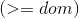
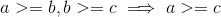
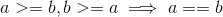
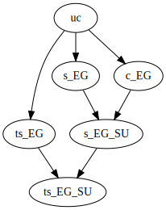
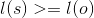
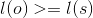

# Lecture 8 - May 28, 2018

## Security Policies and Models

### Trusted Operating System
- trusting an entity, if it misbehaves, then the system security fails.
- **Trust**: we have confidence that it provides secure services.
  - memory, file protection
  - access control, user auth

#### Trusted Software

We need to trust that the code does what it's expected to, and nothing more. Trust can change over time, based on experience.
- Example: Windows XP, bugs were discovered and fixed overtime, trust varied over time.

- **functional correctness**: works correctly
- **enforcement of integrity**: wrong inputs don't impact data correctness
- **limited privilege**: access rights are minimized, not passed onto others
  - listing, checking owners of files
- **appropriate confidence level**: software has been rated as required by the envrionment

#### Factors
1. policy: rules outlining what is secured and why
2. model: implements the policy, reasons about the policy
3. design: spec of how the OS implements the model
4. trust: assurance that the OS is implemented according to design

##### Policy

- rooted in military
  - each object has a sensitivity level
    - object -> ex. files
    - level -> ex. confidential, top secret, unclassified.
  - each object/subject may be assigned to some compartments
    - **Need to know rule**
      - suppose a spy has secret clearance in East Germany, should they have more information (Soviet Union)?
      - If they get captured, want to minimize the data that could be leaked.
  - A subject can access an object iff
    - level(s) >= level(o)
      - subject has "secret" level, object is "unclassified" can access.
    - compartments(s) superset compartments(o)
    - example: James Bond
      - No he can't access, James only has access to "east Germany", therefore not a superset of the file's compartments
      - He can read any file in "Easy Germany"
- commercial security policies
  - classification levels similer: external vs. internal, trade secrets, etc.
  - Different departments may have need to know access (trade secrets)
  - Not as formal as military. access may only be on a temporary or ad-hoc basis.
    - ex. access while working on the project.
- integrity is at least as important as confidentiality
  - don't want data to be modified
  - Clark-wilson security policy: define transactions
    - Goal: transition the system between consistent states
    - `< user, transaction procedure, { .. constraint data ... }>`
    - For a bank, you have some balance at the end of day. Should be the balance at the start of the day - debits
      - constraints could be credit, account policies
    - have rule based: manager needs to sign of on transactions greater than some dollar amount. potentially have multiple transactions.
- Dealing with conflicts of interest
  - students that are also TAs, may get special access to files that may help them in their role as students.
  - Chinese Wall Security policy: popular in consulting firms
    - one analyist works with BMW, another works with Toyota
    - each are barred access to the information from the other analyst.
    - analysts don't have access to multiple companies from the same compartments (have BMW, no other car companies)
    - **ss-property (Read access)**: subject s can access object o iff
      - each object accessed by s is from the same company
      - each object accessed by s is from a different compartment
    - **star-property (write access)**: write access to o from s
      - can have cases of indirect information flow
      - we need to ensure that nothing was leaked out unintentionally
##### Security Models
- Flow from policies
- **lattices**
  - Dominance Relationship 
    - transitive: 
    - assymetric: 
  - lowest upper bound: everthing in higher levels dominates everything in lower levels.

- Bell-La Padula confidentiality model
  - regulates information flow in MLS (laddice) policies
  - users should get access to information according to their clearance
  - information can only flow up
  - ss-property: no read up, can read if clearance of subject dominates that of the object
  - start-property: no write down, write access only if clearance of object dominates that of the subject
    - Don't want to leak information from higher levels (subject has East Germany and Soviet Union, can't write to East Germany exclusive)
  - not practical, can't talk to people on lower levels
- Biba integrity model
  - prevents inappropriate modification of data
    - "dual of Bell-La Padula"
  - subjects and objects are ordered by an integrity level -> answers: should a subject have access to object
  - write access: s can modify o only if 
    - unreliable person can't modify a file containing high integrity information
  - read access: s can read only if 
    - unreliatble information cannot contaminate subjects
    - can't read down
- Low Watermark property
  - bib'a access rules are restrictive, can't read down
  - "dynamic integrity levels"
    - Levels are always going down, never go up
    - subject low watermark property: if subject reads object o, which is of lower integrity, you get labelled with lower integrity (greatest lower bound)
    - object low watermark property: if s modifies o, then the level becomes the greatest lower bound

These models are too simple for practical use.
- covert channel attacks possible

Information Flow control
- describes authorized path through which information can flow
- compiler based IF: a compiler checks whether the information flow in a program violates the policy
  - between variables
  - explicit flow: `y = x`
  - implicit: `if x == 1 then y = 0 else y = 1`
  - ability to taint information
    - input params of a program have a security classification associated with them (lattice-based)
    - compiler runs through the program, marking where the variable is modified
    - can compute security clearance for outputs
    - users can see the outputs only if their security clearance allows
  - Windows Vista
    - tried to implement a variation
    - low, medium, high levels
    - download files, have dynamic model (i.e. want them to access registry)
    - ask every time, thereby increasing the integrity of the object.
    - This is good, but it's annoying for users

Example
- User has secret clearance and compartments {A, B, C}

in the following, does the user have access?

1. Top Secret, {A}
  - read: no the user is only secret
  - write: no the compartments condition does not hold
2. secret, {A}
  - read: yes
  - write: no, compartments not a superset
3. secret, D
  - read: no
  - write: no
4. confidential, {A, B, C}
  - read: yes (higher level, and compartments)
  - write: no (not the right access)
