# Lecture 10 - June 4, 2018

## Gaussian Processes
Facts
1. If x is Gaussian, then  is Gaussian
2. If 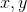 are gaussian, then 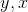 is gaussian
- Gaussian process is a set of joint functions

### Verifying a Kernel
- Gram matrix K, where 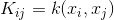
  - symmetric: 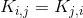
  - positive semi-definate

### Relating to covariance function
- can verify that it's symmetric and PSD
- given any mean function and kernel function, there exists a gaussian process

### Gaussian Process for Regression

- we have a linear model: 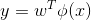, 
- Using a feature space mapping for x, 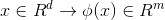
- Construct a  matrix, where 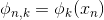
  - this 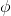 matrix is nxm
  - basically take our feature mapping, and stack all of our samples
- Then, 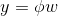
  - y is also a vector
- We can recall the fact that 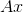 is Gaussian, then y is also gaussian.
  - mean is 0, since mean w is 0
  - covarience is: 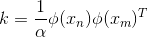
    - This is just the kernel function, Gram matrix
    - Therefore, we only need the kernel function, not 

#### With Noise

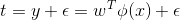
- w is same as before
- 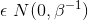

Prediction:

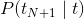_
- we know 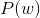 and 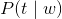 are both gaussian, use fact 2. We can obtain 
- 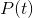 is a gaussian process, Gaussian,
  - covariance matrix: 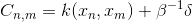
  - delta is 0-1 error

#### Baysian Linear Regression
- as before we knwo 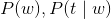
- Therefore by 2: 

### Gaussian Process for Classification

output is no longer continuous, comes from some finite set

#### Binary Classification
- outputs in {0, 1}
- N data samples
- Given an N+1 input, want to predict _
- 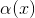 is a GP, which has continuous output. Transform this with the sigmoid function 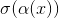
- recall logistic regression:
- 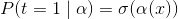
- Can construct the likelihood function
  - 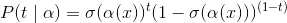

## Mixture Models and EM

### K-Means Clustering
- don't assume any distributional information
- N data samples, want to group into k clusters (given)
- 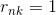_ then the n-th point belongs to the k-th cluster
- Objective function: want to minimize the distance between each data point to the center of the cluster.
  - 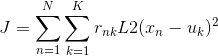
  - Note that each point can only be in a single cluster, therefore only 1 term in the inner sum.

Algorithm
1. Minimize J with respect to the mappings, keeping the centers fixed
  - New mappings
  - Each point belongs to the cluster with the closest center
2. Minimize J with respect to the centers, keeping the mappings fixed
  - compute new centers
  - Centers are just average of all of the points in the cluster
3. repeat (some convergence criteria)
  - iterations
  - stability
  - check loss delta, set some threshold

**Hard Clustering**
- Each point can only belong to a single cluster
- K-MEAN

**Soft Clustering**
- Each point has a probability distribution over the clusters.
- Gaussian

### Mixture Models
- Notice that each gaussian distribution has a single peak (at the mean)
- Mixtures allow for multiple peaks
- Mixed Gaussian: 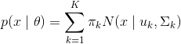
  - sum of the s must equal 1.
- **Latent Random Variables**: Not observed directly, inferred from other observed variables
  - Introduce z to model this mixed distribution
