# Lecture 11 - June 6, 2018

## Review of K-Means
1. start with k random centers
2. label data points with the closest center
3. recompute centers, goto 2 until convergence.

Hard clustering: Each sample can only belong to a single cluster

## Review of Mixture Models

For when we want soft clusters: assign a probability of the sample belonging to each particular class.

Define a latent variable z (one-hot vector)
- then, 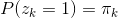
- 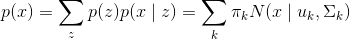
  - If gaussian

Responsibility is what we call the posterior probability
- slide 10
- using bayes rule
- if we observe some data, what is the proability that it comes from the k-th component

ML Estimate
- We can't compute the inner derivative, use iterative approaches instead
- Use gradient descent
- EM - Expectation Maximization:

### Expectation Maximization

Similar steps to k-means
- Take derivative of log-likelihood wrt the mean
  - The denominator is the responsibility
  - assuming we have the responsibility, we can get a closed for solution for the mean
  - multiply by the inverse covariance, can do this since it's contant over the summation, therefore can eliminate it.
  - The mean is just a "soft" average of all the effective points in the cluster.
- Take the derivative of the log-likelihood wrt the covariance
- do the same thing for 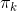
  - constraint: 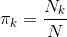
  - N is the total number of samples, 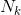 is the effective number of samples.

We typically would start with some initial values for these parameters
- Use K-means for the initial assignment

Expectation step
- Take expectation over the latent variable (cluster assignments) that we don't know
Maximization step
- Maximize the parameters

## Hard Margin SVMs
Support Vector Machines

Problems with kernel methods: predictions requires evaluating the kernel function for all training samples, expensive.
- Goal: Find a sparse solution that allows us to consider a subset of the samples.

### Recall: Perceptron
- we assume that the data is linearly seperable
- 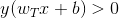 assign positive / negative based on this threshold
- the final solution is influenced by the initial weights and biases, as well as the order in which the training samples as presented.

### Hard Margin SVM
- Binary classification
- assume the data is linearlly seperable
- find the weights and biases such that the margin between the two classes is maximized

#### Recall: MArgin
- minimize the separator for all values of x
- take the maximum for all w, b

#### SVM Optimization
-  function can be incorporated, but it doesn't effect the optimization
- note that 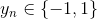
- If our prediction was correct, then the target and the prediction will have the same sign, making the product positive.

Note that if we multiply the weights and biases by a constant factor, k. The actual distance doesn't change.
- ASsume 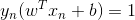 for the closest point (just divide by the value of the closest point.
- Then the margin is 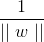, prediction is 1.
- this gives the maximization problem on slide 8
- Therefore, we can minimize the inverse. 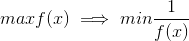
- finally, 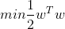
