# Lecture 12 - June 11, 2018

## Hard Margin SVM
- Same setup as the perceptron algorithm
- binary classification, linearly separable, take the `sign`
- Decision boundary sets the weights and bias such that the margin (of the training set) is maximized.

### Generalization
- SVM's rarely overfit

### SVM Optimization
- We get the objective function by simplifying the margin equation.
- include the output (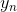) to get rid of the absolute value
  - this value is always positive (the output is just + or - 1).
- If you multiply the weights and bias by some constant, k. Then the distance to the hyperplane doesn't change. Notice the k cancels out in the margin equation.
- Next, we assume that 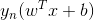 is 1 for the minimum point. If it's not, then we can just multiply by some k such that this condition is true.
- Then replace with 1, add a condition 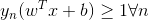
- Next transform the optimization problem to a minimization problem (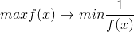 - if f is positive for all inputs)
- Next, do the squared L2 norm, this gets rid of the square root. Note that 
- Some times we divide by , this assists when we take a derivative, the 2 cancels out. (as we arrive at slide 9)

#### How to solve this optimization problem (Lagrange multipliers)?
- For an unconstrained optimization problem, we can just take the derivative by the minimization variable.
- In the case of SVM, we have use the Lagrange multiplier

We assume we have a convex optimization problem
- quadratic

We have 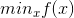 st. 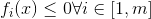
- Where f is a convex function

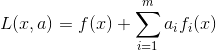
- a is an m-dimensional vector
- 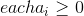
- Transform a constained optimization problem to an unconstrained problem include the constaints in the objective.

Primal Problem: 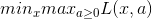_

Dual Problem: 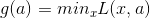
- Turn it into a maximization problem:  st 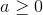
- point can be a max-min: 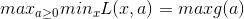
- p-star = d-star

#### Karush-Kuhn-Tucker (KKT) conditions
- sufficient conditions for optimality for points with a zero duality gap

#### Slide13
- note that for prediction, the kernel function is not sparse
- to get around this we use: the values of a that are 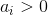
- Use these to support the prediction
- 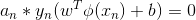
  - either 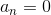 or the second term is 0.
  - using condition 3 of KKT
- Then prediction is utilizing the set of support vectors slide 14 (which is a sparse solution)

#### Slide 15
- decision boundary
- margin boundary: Minimum points lie on the boundry, basis for support vectors (use only these for prediction)

#### How to derive params
Next: Need to derive 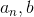
- 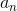 need to solve the dual problem

Derive 
- Solve the duel, get a
- Solve for b using any support vector
- A more stable approach is to take the average value of b across all support vectors

Note that multiplying the equation by  is just multiplying by (1 or -1), solve for b. Then take the average across all support vectors

### Convex sets and Convex hull
- **convex set**: a set of points C is convex is a line segment connecting any two points in C is contained in C.
- **Convex Hull**: Smallest convex set containing C

#### Slide 23

We want to make the optimization problem in terms of a only
- set 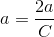

## Soft Margin SVM

In the Hard margin SVM we assume the dataset is linearlly separable in the feature space 
- Remove the hard constrain, allow some points to be on the wrong side of the boundary

Fix a few edge-cases
- non-linearly separable data
- The data is linearly separable, but we want to avoid noisy data points.

Add a penalty term that increases linearly with the distance from the margin boundary
- 0 for points on the correct side of the margin
