# Lecture 14 - June 25, 2018

## Backpropagation

Method to compute the gradient at various points in the network
- Results can be used in an optimization algorithm
  - SGD, Adam, RMSProp
- forward pass: compute the hidden values, output, error
- backward pass: Work backwards through the network, computing gradients
  - use the chain rule
  - 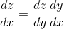
- Complexity: Linear in the number of edges in the network
- Slow to converge
  - can get stuck in local optima
- Overfitting
  - **Early Stopping**: stop training when test error begins to rise
  - **Dropout:** During training "drop" nodes from the network

## Activation Functions

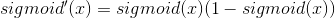
- Range: (0, 1)
- small gradient at saturated regions (extreme 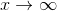, and 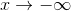)
  - using a gradient base algorithm, means very small updates

tanh
- range: (-1, 1)
- 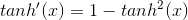
- same problem, small gradients at extremes

### Vanishing gradient problem
- Small gradient values in activiation functions
- For a deep neural network, the gradients of earlier layers results in a large product of values 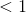, producing a very small delta
- Problem worsens as additional layers are added

#### How to avoid
- initialization of network parameters
- choose activation functions that do not saturate
  - ReLU family
- LSTM or GRU

#### ReLU

[More](https://keras.io/activations/#elu)

- **ReLU**: 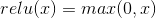
  - gradient is 1 when positive, 0 otherwise
- **Leaky ReLU**: 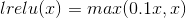
  - gradient is 1 when positive, -constant value when negative
- **Elu**: x if x positive, 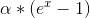 is negative
- **Maxout**: Activation function where the output is the max of it's inputs, [more](https://stats.stackexchange.com/questions/129698/what-is-maxout-in-neural-network)

## Regularization
- Neural networks are likely to overfit
- The number of parameters can exceed the number of data samples
- **Regularization**: modify the learning algorithm in such a way that the **testing performance** is improved
  - Recall L1 and L2 regularization

### Bagging
- Bootstrap Aggregation: train several different models, hope that their average performance converges to the target
  - unlikely for each model to make the same error

#### Method
1. Build a new dataset for each model (say k models)
2. Each dataset has the same size as the original
3. sample **with replacement** from the original dataset
4. Train each model

#### Prediction
- Regression: Average
- Classification: Majority vote

### Dropout
- During training, drop hidden neuron from network with probability p
  - do this for each training sample
- Idea is network can't rely on specific neurons for output, spread capabilities throughout the network.
  - Get results that are similar to training a large ensemble model (with shared params)
- How to set the probability of keeping unit
  - could set it the same for all layers
  - alternaively, set a lower p for overfitting units
    - large number of units
  - usually keep it close to 1

#### Example
- 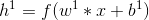
  - suppose h is 4x1
- Randomly (prob p) generate a binary vector, d (same size as h). 1 indicates keeping the neuron
- Hadamard product of h and d
- **Inverted Dropout:** 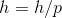
  - goal is to keep the mean value of the output unchanged

#### Prediction
- Training: Use inverted dropout on each training example
- Prediction: don't use dropout
  - If inverted dropout was used during training, no need for additional scaling

### Data Augmentation

Neural networks typically perform better with a larger dataset. You can often engineer a larger dataset utilizing your existing data.
- transform the input in some fashion
  - ex. rotating / transforming images
- May not be possible in all domains
  - ex. can't flip handwritten digits

### Early Stopping
- During training, train error will decrease. validation error will decrease, and eventually increase as the model overfits
- Stop training when this happens

### Batch Normalization (BN)
- Divide dataset into mini-batches
- compute mean and variance for each mini-batch, normalize each point in the mini-batch
-  is there to stablize the calculation
