# Lecture 2, May 7, 2018

## Point Estimation
- Used to estimate the model parameters

### Probability Basics
- Chain Rule: 
- Bayes Rule: 
- Example: What is the prob that a randomly selected individual with a positive test is a drug user?
  - 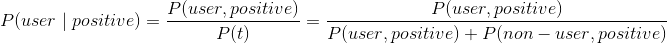
  - 
  - 
  - Why is the drug 99% specific? Large population, with large number of non-users will bring this down.

### Bias and Variance
- Point Esimator: A single estimation of parameter
  - An estimation of  is 
- Bias: 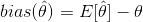
  - Expectation - the true param
  -  is fix and unknown, ie. not random
  - If the bias is 0, unbiased
- Variance: 
  - Your dataset is random, may be noisy

- We would prefer a small bias and small variance
  - We would prefer unbiased

### Likelihood Function
- Descrete: _
  - Use the probability mass function
  - Notice L is a function of , but pms is a function of x given 
- Continuous: _
  - Density function
- We would typically use the log-likelihood function
  - 
  - Note that log is strictly an increasing function, therefore optimization of log-likelihood is the same as the likelihood

### Maximum Likelihood (ML)
- Observations from some distribution: 
- Family of probability distributions: 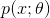
- Maximize the log-likelihood function to get 
  - Or typically, minimize the negative log-likelihood function

#### Example: Bernoulli Distribution
- Suppose 
1. Write down the likelihood function
  - 
2. Log Likelihood function
  - 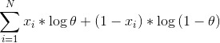
3. Argmax:
  - 
4. solve Derivative for 0:
  - 

Suppose that we have a **convex** function , and is **differentiable**. A necessary and sufficient condition is to solve 
- **Convex**: A function f is convex, if 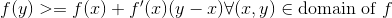

#### How many samples are needed?
- Using Hoeffding's Inequality
- Note that 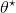 is the true parameter

#### Example: Gaussian Distribution
- Estimate u and 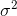 using ML
1. Likelihood Function
  - 
2. Log-likelihood
  - See the slides
- Solve for u and  by taking partial derivatives
  - Note that u must be done first
- Note that 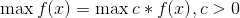

#### Limiting property of ML
- If the data was generated by the assumed model, then the ML estimation will converge to the true probability (with enough data points)
- But, in practice data is never generated by an assumed model. There is always some noise, or our assumption can be wrong.

### Maximum A Posteriori (MAP)
- Bayesian Perspective: treat parameter  as random with prior distribution 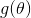 (ex. uniform, gaussian)
  - Therefore, it's not fixed
- Given data x, maximize posterior distribution to get 
  - 
  - The dinominator is independent of , only relies on x.
- Difference to ML: multiply by the prior

### Fully Bayesian Approach
- Include all possible values of 
- Typically generalize better with limited training data, high computational cost, usually intractable.
- 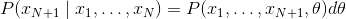_
- 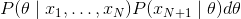_

## Bias-Variance Tradeoff
- Recall that we would like a small bias and small variance, but there are some tradeoffs...
- High bias: Bad assumptions (underfitting)
- High variance: sensitive to small changes in the training set (overfitting)

### Mean Squared Error
- Assume 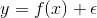
- 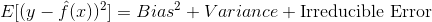
  - You can't do anything to remove the noise
  - Noise has mean = 0, variance

### Training and Testing Error
- Divide the dataset into a training and testing part
  - They should both come from independent and identically distributed
  - Important: The test data cannot be used for training the model
- **Objective**: Low test error
  - The more complex the model, the lower the training error will be. But this will likely make the testing error worse as the model fails to generalize.
  - training error is a bad measure because you have the answers, it is only used to construct the model.

## Feature Scaling

- We want to scale our feature set as a part of preprocessing
- Each feature should contribute equally to the model, i.e. features with large values should not be the main predictors.

### Standardization
- Centering: Make sure no features are arbitrarily large
  - Mean 0, variance 1
- Scaling: Make sure all features have roughly the same scale
  - 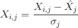
  - _ (The mean)

When to do standardization
- Some features are significantly smaller or larger than the others.
- Orders of magnitude.

### Normalization
- Choose the mean and maximum of each feature
- Make it between 0 and 1
