# Lecture 3 - May 9, 2018: Linear Regression

## Regression

Given a pair , find a function f such that: 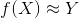
- X: d-dim real vector, feature vector
- Y: Continuous response, 1-dim real value

Problems:
1. (X, Y) is uncertain: training samples are from some unknown distribution
  - pulled from some unknown function
  - typically noisy in some aspect
2. Measure the error using a loss function
  - Which one should we use?

### Risk Minimization
- Minimize the expected loss: 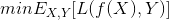_
- Note that f(x) and Y are in the Y range.
- 
- Least Squares: 
  - minimize the squared difference between our prediction and the true output

### Regression Function
- We can compose the expectation over 2 steps
  - 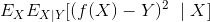_
  - Note that if we minimize the inner objective (), then it's the same as minimzing the entire
  - _
  - 

### linear hypothesis

### Example Housing Prices

| Size (square feet) -  | # bedrooms  | Number of floor s | Age of Home 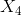 | Price ($1000s)  |
|-|-|-|-|-|
| 2104 | 5 | 1 | 45 | 460 |
| 1416 | 3 | 2 | 40 | 232 |
| 1534 | 3 | 2 | 30 | 315 |
| 852 | 2 | 1 | 36 | 178 |

- First 4 columns are the input features
- Last column is the output
- 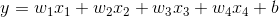

#### Formally

Assumptions
- Linear in w
  - this is more important, we can replace x with something non-linear
- Linear in x

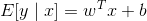
- w and x are both column vectors, this is an inner product.
- Note: 
- Loss function: Mean Squared Error
  - 
- Empirical Risk (mean)
  - Ideally we would want to use the true distribution, but we don't know what this is.

### Simplification Again (Slide 11)
- 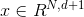: Just add 1 to the top of x
- add the bias to the top of w, is a d+1 vector
- Last one is L2 Norm

### Connection to ML (slide 13)
1. Likelihood function
  - Recall that this is just the pdf of the underlying distribution
  - For this example it's just the PDF of the normal distribution
Recall that the constant coeifficents can be ignored as they don't effect the optimization of the objective function.
- Maximizing the negative is the same as minimizing the positive

### Normal Equation
- Recall that the squared L2-Norm can be written as 
- To simplify remember
  - 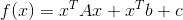
  - 
- Using the facts we get: 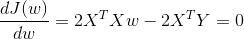
  - solve and divide by 2 to get the Normal equation
- Normal Equation: 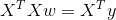
  - Solve this using the system of linear equations
    - Easier / more efficient to implement: , instead of 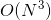
  - Analytical solution is 

#### When it is non-invertable
- Redundent features (linearly dependent)
  - Can get around this by deleting the redundent features
- Can also occur if there are too many features 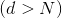
  - Delete features or use regularization

### Gradient Descent
- 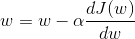
  - iterate until convergence
  - If the learning rate is too low, the algorithm will take a very long time
  - If the learning rate is too high, it will fail to converge
  - See chapter 9 in Convex Optimization to choose learning rate.
- 
- Need to make sure that the features are on the same scale
  - We can do standardization: 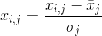
  - Example: In the housing example the features are not on the same scale

### Gradient vs. Normal Equation Trade-offs

Gradient
- need to choose learning rate
- many iterations
- works well for many features

Normal Equation
- No learning rate
- No iterations
- Slow if the number of features is large
  - Recall that 

### Non-Linear Regression
- We can do it by constructing a different features space and doing linear regression in that space

#### Example
- Suppose we have a quadratic model: 
- Construct a vector 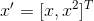, then 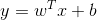

#### Quadratic Fitting
- underlying function is quadratic
- 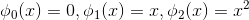
- Polynomial Regression: 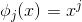
  - Use the linear regression framework as usual.
