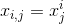
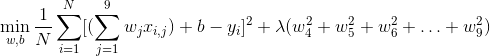
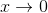
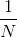
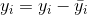
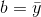
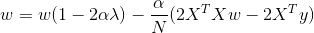
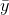
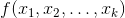
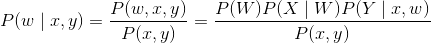

# Lecture 4 - May 14, 2018

## Linear Regression
- Must be linear wrt w, we can make a transform using a non-linear basis function for x.

### What if the normal equation matrix is not invertible?
- Too many features
  - delete redundant
- Add regularization terms

### Gradient Descent
- Need to do feature scaling in order to increase likelihood of convergence

## Generalized Linear Regression
- Why do we do this? We know linear regression well, this allows use to extend our knowledge to non-linear problems.

## Overfitting
- Model can't generalize to new data.
- Very low training error, high testing error

### How to address?
- Reduce the number of features
- regularization: penalize high magnitude features

### Polynomial Curve Fitting Example
- 
- 
- If we set  to be very large, then when we minimize the objective functions, these terms will be zero close to 0.

### Ridge Regression
- Add a penalty term
- Some hyperparameter , that controls the penalty
  - Larger lambda puts those terms to 0
- L1, L2 norms.

Goals of the terms
- First: Minimize the training error
- Second: Regulatization terms. Goal is to get a simplify the model.
  - This term is only related to w, not to the bias.
  - The reason for this is that bias just control the intercept, not really the complexity of the model.

-  (small): basically back to Least Squares
- : w close to 0.

What happens if we remove ?
- changes the optimal 

### Pre-processing
- To simplify the model, we can remove the intercept param via centering and standardization

#### Center Output
- _
  - subtract by the mean
- See feature scaling

#### Standardize input
- subtract by the mean, divide by standardization.

#### Solution (slide 31)
- Optimal value of 
- Take the derivative of the equation, solve for b.
- Basically redefine X and Y in terms of the centered and standardized output
- Quadratic optimization problem

#### Ridge Regression with Gradient Descent
- 

#### Predictions
- We have some new input value
- Need to standardize it (using the empirical values on the training set)
- transform the output by adding the empirical mean  back (again from the model)

### Connection to MAP
-  ~ N(u, sig)
  - pdf is regular normal
- 

### Sparse
- When terms are close to 0
- Use L1 regularization
- downside: no closed form solution

## Cross Validation

### Conventional Validation
- Partition datasets into train, validation, and test sets (typical ratio: 60/20/20)
  - Train: Helps us fit the model
  - validation set: helps us to choose the best hyperparams
  - test set: assess the model (generalization error)
