# Lecture 5 - May 18, 2018

## ASsignment
- Problem 4
  - Use first 30 as validation set

## Cross Validation
- partition your data into train + validation + test sets
- **Model Selection**: Select the hyperparameters that give you the best result

How to build a linear model?
1. Use the training data to build the model
  - Do this for each lambda
2. Use the validation set, calculate the validation error (using your loss function, ex. MSE)
  - Find the minimal validation loss, pick the value of lambda that gives you that
3. Calculate the test error using the model with the best lambda.

This can be extended to k cross validation
- merge the training set and validation sets together
- shuffle the data
- partition the data into k sections ("Folds")
- select a lambda value
  - for each k, pick one as the validation set, remaining (k-1) as the training set
    - Train the model on each fold
    - Get k validation errors, take the average
- Choose the lambda with the best validation error
- after picking this lambda, you can retrain using the entire training set. This gives you more data samples to work with.

If you have a large dataset, cross-validation may not be necessary
- it may be enough to just partition into training, validation, and test set.

## K-Nearest Neighbours
- can be utilized in classification and regression workloads

### Review of Supervised Learning
- given training data 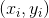. Goal is to return a function 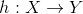 (hypothesis) that approximates the true mapping.
- Regression: Continuous outputs
  - In practice it may not be truely continuous (ex. housing prices)
- Classification: Output belongs to some finite set

**Hypothesis Space**: set of all hypotheses that the learning algorithm may consider
- find the hypothesis from this set that minimizes Test error
- An h that correctly predicts all training examples (100% train error), is consistent with the training data.
  - in practice, there is typically some noise
  - The real mapping is actually outside of the hypothesis space.
    - Ex. Used a linear model, but the data is quadratic
- Focus on **generalization**: the ability to predict unseen examples
- **underfitting**: unable to learn the nuances of the data
  - high training error
  - therefore, the model is likely not complex enough. Or there is some incorrect assumption
- **Overfitting**: The model cannot generalize to unseen examples
  - high testing error, low training error
  - Captures all of the noise in the training set.
  - not enough training examples

### KNN

#### Classification Example (Slide 9)
- X: 2-d space
- Y: `{0: blue, 1: orange}`

If we use linear regression (assuming linear basis function), then our algorithm will find some linear decision boundary between the 2 classes.
- If the data is not linearly separable, then the model will likely underfit.

Using (1) Nearest Neighbours
- have some distance function, use this as a proxy for similarity
- we make no assumptions about the training data
  - The underlying distribution of the data doesn't matter
  - ex. Don't care if it's Gaussian with some noise.
  - Allows this model to work with essentially random data.
- formally: we want a classification function 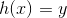, where 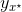 is the output for the nearest neighbour, i.e. 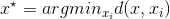.

#### Distance Functions

a proper distance function must satisfy the following properties

- Symmetry: 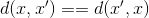
- Definite: 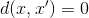 iff 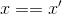
- Triangle Inequality: 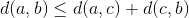

Different types:
- 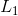: sum of the absolute difference
- : sum of the squared differences
- _: largest difference between 2 features

#### Complexity Properties
- Training, simply store the dataset 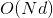 space
- Testing: Run through each testing point, compute distance for each point  (worst case, you run through each data sample in the training set)

### KNN for Classification
- increase k, take the most frequent result (the mode)
- less variance as k increases, smoother decision boundry.
- To calculate misclassification error, use 0-1 loss.
  - 0 if correct classification, 1 otherwise

### How to Choose k
- can't use training error (it increases with k)
- Use corss-validation, test error
- depends on your problem / dataset

### Weighted KNN for classification
- majority voting has downfalls, suppose there are many more samples of class A then B (binary classification)
- In this case, higher k will cause frequent missclassifications for class B.
- Instead, weight the votes by the distances. Choose the class with the maximum weighted sum.
  - small distances => larger weights => larger votes
- This way, closer points have more power. Hopefully cancelling out the effects of having points of a different class that are further away.

### KNN for regression
- Do the same thing
- change the mode to average, choose the estimation as the average of the outputs.
- weighted: compute the weighted average
