# Lecture 8 - May 28, 2018

## Perceptrons
- Basic neural network, Inspired by the brain.
- Artifical network: just input and output (no hidden layers)


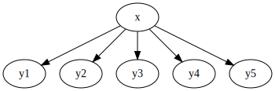

Neuron is activated if: 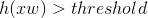
- activation function could be the `sign(t)` function: 1 if t > 0, -1 otherwise
- 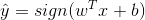
- Note that higher order features will have greater influence on the predictions
  - if you want equal, just feature scaling
- batch learning
  - evaluate performance on test dataset
  - divide dataset into training and testing sets
- online learning
  - streaming data samples
  - predict outputs before knowing the target values
  - Interested in making the lowest error possible
- Online -> batch
  - can simply use
  - online to batch may not work properly

### Online training algorithm

```python
for i in range(1, maxIter):
  for (x, y) in D:
    a = np.dot(w.T, x) + b
    if y*a <= 0: # This tells us that the prediction was wrong (differing signs)
      w[d] = w[d] + y*x[d] # for all d = 1..D
      b += y

return w, b
```

Why error driven updates?
- if we're incorrect, push the parameters to the correct direction.

### Spam Filtering Classification Example
- Feature set: 6 words, x[i] is 1 if the word[i] is present
- output: 1 -> ham, -1 -> spam
- initially set all parameters to 0

| Iteration | Weights, bias | prediction |
|-|-|-|
| 0 | 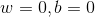 | 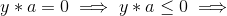 Update|
| 1 | 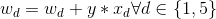, 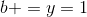 | 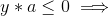 update |
... See slide 13

continue until convergence or have some maximum number of iterations
- convergence: pass through the entire training set, without any updates to weights / bias
  - the algorithm can correctly predict all training examples

### Perceptron Convergence Theorem
- Linearly separable dataset: data points can be separated by some linear function (hyperplane)
- margin: 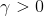, L1 norm of X is less than or equal to 1
- algorithm will converge after at most 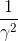 updates
- **Note**: if the dataset isn't linearly separable then the algorithm will never converge

#### Margin
- distance between a point x and a hyperplane: 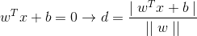
- 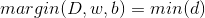 for all x (the minimum distance), if linearly separable. Otherwise margin is 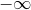
- 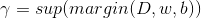
  - sup: maximum margin
  - Think support vectors

#### Training tips
- suppose dataset is 500 positive examples, then 500 negative
- origionally, the perceptron algorithm would place too much emphasis on later examples
- **solution**: shuffle the dataset before each training iteration

#### Abitrary Linear Separator
- the larger the margin, the faster convergence
- but it may not stop at the optimal linear separator
  - there could be other separators that work in your dataset
  - order of training examples and initial values of w,b influence this separator

#### When to stop
- online: never
- batch: have some maximum number of iterations
  - 1 too small (underfitting)
  - too high (overfitting)
  - save weights and biases at each iteration, use the ones that give the best test error.

### Alternative Approach
- 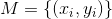 be the set of misclassified examples (i.e. 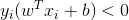)
- Use vector forms, add bias to the weights matrix and each feature (augmented form).
- If correct prediction, the loss is 0. Otherwise, 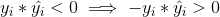

#### Stocastic gradient descent
- Perform an update after looking at each sample (note: still online, update as we get stream)
- 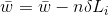
  - n is the learning rate
  - when learning rate is 1, just the threshold algorithm
  - typically want to decrease overtime, sum of squares less than inf, sum less equal to inf

### Multiclass Perceptron
- Up to now, binary classification
- y is now k classes, predictions 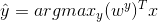
  - have a weight matrix for each class
  - predicted class is just the output that has the maximum score
- still do error driven updates
  - if incorrect, we know the correct class, update the relevant weight matrix () and the incorrect weight matrix (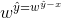)
  - move the weights of the correct class in the right direction, move the incorrect weights away from that guess.

### What not linearlly separable

If not linearlly separable, won't converge
- typically the weights will enter some infinite cycle.
- Find better features
- kernel methods
- Deeper neural networks

## Kernels

### Feature space mappings

Recall basis functions.
Given inputs on some d dimensional space, map them to M dimensions
- 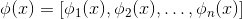
- M could be infinite
- example
  - 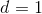, 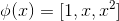

### Kernel Functions
- some function k: 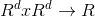
  - 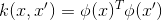
  - 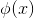 is some feature space mapping
  - just inner product
  - we don't care about the specific values of the phi functions, just the kernel function value.
    - For example, if M is infinite, we can often compute the kernel function without needing the infinite vectors.

#### Verify Kernel Function example
- can just separate the variables, define the phi function, show the inner product.

#### Gram Matrix
- Defines a condition to be a valid kernel function
- N: the number of training examples
- 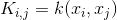
  - symmetric: 
  - positive semi-definite: 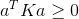
    - check that all eigenvalues of K are positive
    - K can be decomposed as 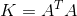

#### Constructing Kernels
- start with , make 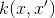
- Construct the kernel function directly (without needing to know the phi function)

next class...
