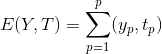
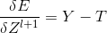
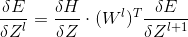
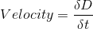
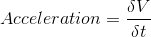

# Lecture 14 - February 2, 2018

## Deep Neural Networks
- Universal Approximation Theorem

## Enhancing Optimization
- Minimize the expected loss over all training samples
- Inputs and targets are individual vectors, can assemble these into matricies.
  - Use each in a column, then weights can multiply out
  - Perform outer product with `[1, 1, ...., 1]` on bias to apply to all

### Backprop

#### Output Layer
- 
- 
  - Y rows, P columns

#### Working Back
- Basically do the same thing as before, but each sample is a column
- 
  - 1 column for each sample

#### Problems
- This approach is slow if the dataset is very large
- Very few updates

### Stochastic Gradient Descent
- Take mini-batches of training samples
- Randomly select from the dataset
- Use batches to determine weight updates
- More stable than processing individuals at a time.
- this can use the matrix ideas as above, just number of columns == batch size

### Momentum
- During gradient descent, there is oscillation (stepping past, going back)
- From physics:  and 
- Solving numerically using Euler's method
- Think about friction, take your foot off of the accelerator, slow down over time

