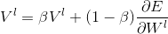
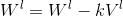
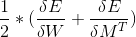
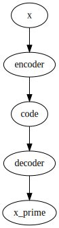

# Lecture 15 - February 5, 2018

- capgrass illusion: differential between visual response and emotional response

## Stochastic Gradient Descent: Review
- Updating weights after every sample is infeasible
- instead process in batches, then update errors
- Help smooth learning

### Momentum
- Analogy can be made between Acceleration, Velocity, Distance and Error gradient, weights update, weights
- : Accumulation of momentum
- : Actually update the weights

## Unsupervised Learning
- 2 networks
  - Encoder
  - Decoder
- Output of encoder is sent to the input as the decoder
- things could be setup such the decoder is a true inverse of the encoder, or so that they are explicity distinct.
  - When performing backprop, tie the weights (i.e. perform the same increment)
  - 

