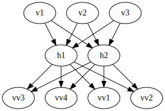
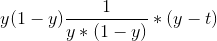

# Lecture 18 - February 12, 2018

## Restricted Boltzman Machines
- Visible (input) layer and hidden layer
- Goal is to find weight matrix

### Training Strategy
```python
for temp in [20, 10, 5, 2, 1]:
  for epoch in range(400):
    for batch in range(40): # instead of doing loop, can use matrix algebra instead
      # choose a visible sample
      # add noise
      # Project up: S1, V1, H1
      # Project Down and Up: S2, V2, H2
      # increment statistics (using differences)
    # Update weight matrix
```

### Deep Belief Network
- After you've trained one layer, can train another on top of it




## Assignment 2

### Q3
- I should of had these as a vector, not summation

