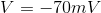
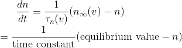
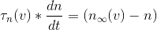
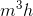
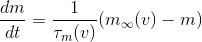
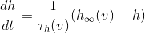

# Lecture 2 - January 5, 2018

Brains are electrical devices, how do brains work?

## Biology

Ions are moecules (atoms) in which he number of electrons doesn't match the number of protons
- Net charge

Ion channels (gates) embedded in the cell membrane can allow ions to pass
- Sodium intake channel
- Potassium extrection channel

### Sodium-Potassium Pump
- A gate which exchanges 3 soldium (inside cell) for 2 potassium (outside cell)
- Consumes energy to perform this exchange

### Membrane Potential
This exchange creates a net positive charge outisde of the cell (net negative inside). a voltage difference.

## Hodgkin-Huxley Neuron Model
A model of an action potential (spike)
- "Spikes" -> what happens when neurons fire

A neuron usually keeps a membrane potential of around .

### Potassium Channels
The fraction of potassium channels that are open is .

- Larger time constant means it takes longer to get to equilibrium.

Typically written as 

### Sodium Channels
The fractionof sodium ion channels open is 

### When the input current is negative?
Resting state
- Potassium channels as closed
- Sodium channels are closed

### When the input current is zero?
- Depolarizing the neuron, voltage will start going up
-  increase, while  decreases
- Gates opening, positive feedback loop -> Action potential
- Until eventually the potassium channels close.

