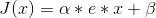
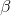
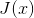
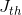
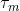
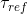
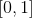
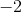
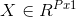
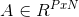

# Lecture 21 - February 26, 2018

## Midterm
- Everything upto and including variational autoencoders and Maps
- pre-reading week

## Assignment 3
- For dropout, no need to touch `Backprop`.
- As a result, it only needs to work on 1 hidden layer.

## Hubel and Wiesel Cat
- Monitor a few neurons in the cat's visual corex
- See what those neurons encode

## Neural Coding
- Recall LIF, If input current is fixed and above the threshold
- neuron encodes a quantity if the neuron's activity changes as the value changes
  - i.e. manupilating lights on a screen

### Population Coding
- Neurons react to some external environmental variable
  - reacting to light, brightness, etc
- Can build tuning curves of the neurons
- Then, given states of the neurons, you can reverse-engineer the state on the brain
  - Read the mind
  - Where was the cat looking

#### Linear coding
- Use a linear remapping to approximate all of the intermediate processes
  - There are many different processes between the input and the neuron
  - i.e. eye-ball -> a bunch of neurons -> the neuron that we're monitoring
  - 
  - : gain, positive real number
  - e: The encoder: $$e \in \left\{-1, 1\right\}
  - : Bias, real number

 is the current entering the neuron for stimulus x, LIF neuron characterised by:
1. : Threshold (we just set it to 1)
2. : Membrane time constant
3. : refactory period
4. : Gain
5. : Bias
6. : Encoder

##### Decoding Excersice
- : Input must be around Hz
- [1, 2]: Around 0hz
- [2, 3]: Around -1hz
- [3, 4]: Around 2hz

In reality each neuron has a stochastic element, therefore you want to have a higher number of neurons to improve stats.

##### Optimal Linear Decoding
-  is a column vector containing P x-values (inputs)
-  is a PxN matrix with each row containing the activities (firing rates) of N neurons for the corresponding input value.
