# Lecture 22 - February 28, 2018

## Population Coding

### Linear Coding

Goal is to find a set of decoding weights 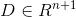, such that 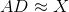.
- Or 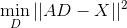

#### Least Squares

##### Method 1: Normal Equations
- The columns of A have to be linearly independent in order to have a unique solution.
- This method is efficient to compute, but may not be numerically stable.

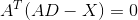
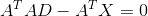
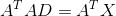: Normal Equations
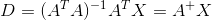

##### Method 2: SVD
- A more computationally expensive method, but more numerically stable

Let $$U \sigma V^T = A$
- 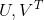 are orthogonal matricies
- : diagonal matrix

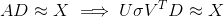
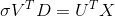
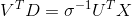
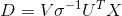

