# Lecture 25ish - March 9, 2018

## Neural Decoding Overview

1. behavioural sampling
  - A bunch of input stimulus are recieved
  - Brain accepts input and processes it
  - We can sample these neural activities.
  - Choose X, use simulation to get A (activities of the neurons)

2. Compute Decoders
  - Use data from behavioural experiment to solve:
  - 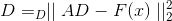
  - Decoding list is how to interperete neural activities
3. Decode neural activity
  - Now you can decode further neural activitty
  - i.e. given 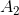 you can estimate 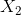

## Neural Transformations
- In the brains, populations of neurons send their activities to other neurons.

### Encoders and Decoders
- Given 2 populations A and B can we simply copy the weights from A to B
  - No, it's unlikely that both A and B are of the same dimension (number of neurons)
- Can use an autoencoder:
  - Decode input from A
  - Re-interpret results into B

1. Encode input x into A
  - 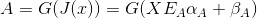
    - J input current
    - G is activation function
    - X is 1xK vector
    - 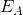: KxN
    - 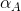: NxN diagonal matrix
    - Bias for each neuron (1 x N)
    - A is a 1xN vector, giving the activity for N vectors
2. Decode the value from A
  - 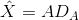
  - the indentity decoding weights
  - Recall that the decoding weights are created from solving the least squares problem
3. RE-encode into B
  - 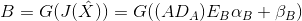
  - 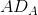 is 1xk
  - 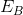: is kxM
  - : is MxM diagonal matrix
  - Rewrite as 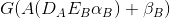
    - Notice that the product: 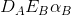 is NxM
    - Call this product W.
4. Decode from B if desired
