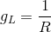
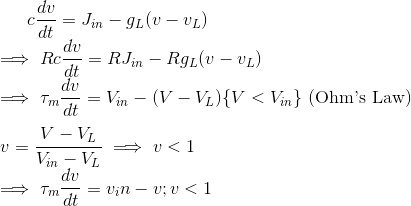
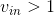
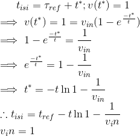

# Lecture 3 - January 8, 2018

## Simpler Neural Models
In a HH model, you need to solve a 4-D system. Instead, we can use 1 variable. Don't need to model the spike itself, just when it happens.

### Leaky Integrate and Fire (LIF) Model
- Simply records when the spike occurs (i.e. when the voltage reaches the threashold)

Let 

**Eurler's Method for assignment 1**

If  the LIF neuron will spike.

