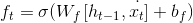
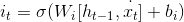
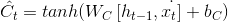
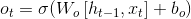
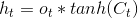
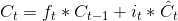

# Lecture 30 - March 19, 2018

## LSTMs: Long-Short Term Memory Networks
- RNNs are bad at handling long term dependencies
- RNNS suffer from exploding / vanishing gradient problems
  - Multiplication of many terms above / under 0

### Architecture
- forget gate: how much from previous time steps
  - 
- input gate: how much of current time step we care about
  - 
  - 
- output gate:
  - 
  - 
- cell state: combination of previous cell state and the candidate of current state
  - 
  - Gradient is a constant term, helps to avoid vanishing gradient

### Backprop in LSTM
- want the error with respect to the previous state
-
## LSTM variant: Gated-Recurrent Unit (GRU)
- Similar gating mechanisms, but no cell states

## Open Questions
- Avoid vanishing / exploding gradient problem
  - Use RELU: gradient is linear
  - Regularization
  - Weight initialization
    - Research into using RNNS with proper weight initialization, can produce similar results to LSTMs with 4x fewer params.
