# Lecture 32ish - April 2, 2018

## Word2Vec
- embedding words, one-hot encoding ignores the semantic relationships between words
- Word2Vec: Autoencoder type structure, compress to a smaller space, reproject to predict nearby words. Co-occuring words.
  - hidden layer -> embedding space

- Similar to Self-Organizing Map (SOM)
  - Similar words organize themselves into a closer topological space
  - Words with similar meaning likely will occur with the same set of words, so the network should produce similar output. Therefore, the embedding (hidden) representation should also be similar.
  - We care about the embedding activations (i.e. throw away the output layer), use the embeddings as features in some other model (instead of the actual words)

Typical loss function: cosine proximity, the angle between two vectors

## Equilibrium Propogation
- Biologically realistic way of doing backprop
- way of doing backprop without knowing the gradients themselves
- Internal Energy: 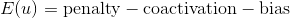
  - coactivation: When both nodes are active at the same time
  - W is symmetric
- 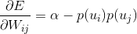
  - similar to RBMs
- Output Loss: 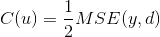
- Total Energy: 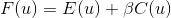
  - if 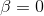: energy ignores the targets
  - if 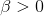: energy includes the output loss
- Network behaviour governed by: 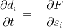, where 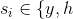
- Rewrite F: 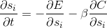
  - 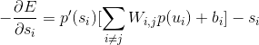
    - similar to a leaky integrator node
  - 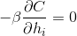
  - 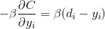
- 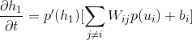
