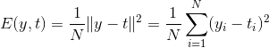
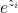
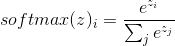

# Lecture 5 - January 12

## Representation of Neural Networks
- Input, output vectors
- Weights on the edges and a bias vector
- Can represent everything as matrix-vector operations.
- A layer can be represented as  and 

Alternatevly:

## Neural Learning
- To get the network to do what you want, you must find the connection weights that yeild the desired behaviour.
- Adjust connection weights + biases

### Supervised Learning
- Labelled data
- Can compute the real error and adjust.

### Unsupervised Learning
- Unlabelled data
- Not clear what the output should be
- Goal is to find an efficient representation of the structure of the data.

### Reinforement Learning
- Given infrequent feedback to guide
- Example: feedback when win/loose a game, no mention of inbetween steps / how to improve.

## Cost Functions
Need to quantify how close the true output and prediction were for input $x$, our target is  and the output of the network is .

### Mean Squared Error
- Associated with linear or ReLu activation functions
- Regression problems

### Cross Entropy
- **Assumption**: Output is between `[0,1]` / binary.
- Sigmoid activation functions

#### Sidenote: Softmax Activation Function
- Ensures the elements add up to 1 (think a probability distribution)
- Take each element as the power of e (i.e. ), divided by the sum of the new vector.
- 
- 

#### One-Hot Encoding
- Set the max element of a vector to 1, the remainder to 0

## Optimization
- One the cost function is formulated, we can define the neural network as an optimization problem.

Let the network be represented by 
Goal: 
