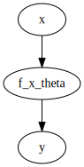
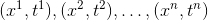
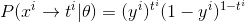
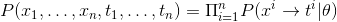
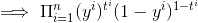
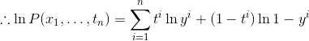
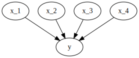

# Lecture 6 - January 15, 2018

## Supervised Learning
Types of problems:

### Regression
Goal: Estimate some continuous value
- Mean squared error is a more relevant cost function

### Classification
Goal: Estimate the class of the input
- Example: Given an image, determine what digit it is.
- Think the cross-entropy cost function

## Cross-Entropy Cost Function Derivation - Assignment 2




Suppose we are given a training set:



Where the true class is expressed in the target: 

```
t^i = 1 if x^i in C
t^i = 0 otherwise
```



The liklihood of observing the data set is the product:




More convenient to look at log liklihood (note )



## Perception
Most basic neural network.



