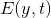
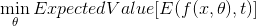
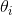
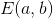
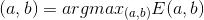
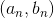
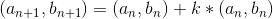
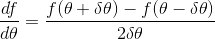

# Lecture 7 - January 17, 2018

## Perceptrons
- Basic threshold activation function
- Single Layer (no hidden layers)

### Graphical Representation
Can represent the network as a linear combination of the inputs, represents a plane.
- Linear separation of the data into classes (linear classifier)
- Limits the capabilities of perceptrons, can only separate linear classes. Need more complex architecture to handle nonlinear.

## Gradient Descent

The operations of the network can be written as  with some cost (loss) function , then learning is the optimization problem.

Need the gradient for E: Take partial derivatives wrt to each  param (weights and biases).

### Gradient Based Optimization

If you want to find the local maximum of a function, start somewhere, and keep going up the hill. Want to maximize :

If your current position is , then the next position is 

In the case of neural networks, we're typically interested in minimizing the loss/error. **Gradient Descent**.

#### Note
Gradient learning provides no guarantees that the optima found is the global optima, possible to get stuck on some local.

#### Approximation of Gradients

We can estimate the partial derivitives  neumerically, using **Finite-Difference Approximation**, Central differencing.

